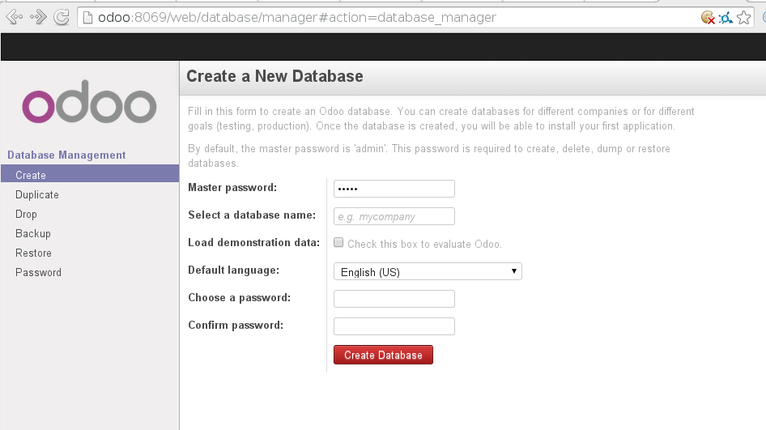

# Notas de prácticas con Odoo (antiguo OpenERP) v8

Por Ismael Olea (<ismael@olea.org>) para la asignatura «Gestión de datos en Sistemas de Información Web» del curso de adaptación al g rado de informática de 2015 de la Universidad de Almería.

## POR HACER 
 
 - [x] empezar este documento
 - [ ] escribir alguna introducción
 - [ ] conexión web cifrada X509
 - [ ] detallar los preliminares
 
## Preliminares

Este manual está escrito usando una configuración de sistemas operativos Fedora/CentOS/RHEL. Probablemente la mayor parte de los contenidos son aplicabables directamente o con cambios triviales en otras plataformas.

Es necesario instalar dependencias:

``` bash
dnf install -y docker-io fig    # instalamos los paquetes que vamos a necesitar con todas sus dependencias
systemctl enable docker.service # activamos el servicio docker desde el arranque del sistema
systemctl start docker.service  # ponemos en ejecución el servicio docker
```

En general, para usar docker es necesario tener permisos de superusuario, pero podemos evitarlo añadiendo nuestro *usuario* al grupo adecuado del sistema:
``` bash
usermod usuario -G docker
```

 
## Configuración de los contenedores

En este caso usaremos una aproximación de operación con contenedores [Docker] (https:/docker.com/). La tecnología de contenedores permite configuraciones semejantes a las que se pueden hacer con máquinas virtuales pero con menos coste de memoria y CPU. Eso no significa que un contenedor pueda sustituir a una máquina virtual (corriendo sobre kvm, Xen, VirtualBox o VMWare) en todos los casos o que sea superior a estas en todas las circunstancias. Sin embargo es una aproximación de moda que cuenta con varias comodidades.

Podemos levantar una configuración de contenedores docker de varias maneras pero aquí proponemos usar la herramienta [fig](http://www.fig.sh/) porque su fichero de configuración es muy expresivo.

También usaremos imágenes docker publicadas en el (registro público del proyecto) [https://registry.hub.docker.com/].

 Creamos el directorio para el proyecto (el nombre es arbitrario):
 
``` bash
mkdir conf-odoo-docker
cd conf-odoo-docker
```
 
y dentro crearemos un fichero llamado *Dockerfile*:
```
# http://registry.hub.docker.com/u/yajo/odoo/
 
FROM yajo/odoo
ADD extra-addons /opt/odoo/
```

y otro fichero llamado *fig.yml*:
```
# https://registry.hub.docker.com/u/yajo/odoo/

app:
    image: yajo/odoo
    ports:
        - "1984:1984"
        - "8069:8069"
        - "8072:8072"
    volumes:
        - addons:/opt/odoo/extra-addons
    links:
        - db
    environment:
        - ODOO_SERVER=odoo.py
    command: launch
dbfiles:
    image: yajo/postgres:data
db:
    image: yajo/postgres:9.2
    volumes_from:
        - dbfiles
    environment:
        - USER=admin
        - PASSWORD=contraseñabbdd

```

Puede observarse que el fichero fig.yml es bastante explícito. Define tres contenedores diferentes y las respectivas propiedades docker de los mismos:

 * *app*: contiene el ejecutable de la aplicación
 * *dbfiles*: sólo contendrá física y meramente la base de datos de la aplicación
 *  *db*: contiene un SGBD *postgresql* que explotará los datos de *dbfiles* y al que atacará Odoo corriendo en *app*.
 
 La mayoría de los detalles de la configuración casi se explican por sí mismos.
 
## Iniciando los contenedores

Para saber si docker está operativo en nuestro sistema podemos usar la orden `docker info` que dará un resultado semejante a :
 
``` bash
$ docker info
Containers: 0
Images: 158
Storage Driver: devicemapper
 Pool Name: docker-253:1-1970278-pool
 Pool Blocksize: 65.54 kB
 Data file: /var/lib/docker/devicemapper/devicemapper/data
 Metadata file: /var/lib/docker/devicemapper/devicemapper/metadata
 Data Space Used: 6.67 GB
 Data Space Total: 107.4 GB
 Metadata Space Used: 9.781 MB
 Metadata Space Total: 2.147 GB
 Library Version: 1.02.93 (2015-01-21)
Execution Driver: native-0.2
Kernel Version: 3.17.4-301.fc21.x86_64
Operating System: Fedora 21 (Twenty One)
CPUs: 4
Total Memory: 11.73 GiB
Name: torlpedo.local
ID: AWLT:ZWM2:TPPM:6ORZ:V4RH:LSYM:ZSTX:JUJP:HRRP:U4WS:YGGJ:MY2G
```
Y verificamos que no hay contenedores instalados usando `docker ps -a`:
``` bash
$ docker ps -a
CONTAINER ID        IMAGE               COMMAND             CREATED             STATUS              PORTS               NAMES

```

Entonces, desde el mismo subdirectorio en el que nos encontramos, podemos usar la orden fig para levantar la configuración de los tres contenedores:
``` bash
$ fig up -d
Creating odoodocker_dbfiles_1...
Creating odoodocker_db_1...
Creating odoodocker_app_1...

```

Obsérvese:

 * que la opción *-d* (por _detach_) que levanta los contenedores corriendo como proceso de fondo;
 * que docker busca las imágenes preconfiguradas que indicamos en *fig.yml* primero entre las que están operativas en el sistema, después entre las descargadas en su caché interna y finalmente las descarga del registro público y que todo el proceso es completamente automático y transparente;
 * que *fig* ha añadido el prefijo _odoodocker_*  a cada nombre que elegimos para los contenedores.
 
 A continuación podemos comprobar que realmente nuestros contenedores están operativos
 
``` bash
$ docker ps
CONTAINER ID        IMAGE               COMMAND                CREATED             STATUS              PORTS                                                                    NAMES
68f8e57d9b00        yajo/odoo:latest    "launch"               3 minutes ago       Up 3 minutes        0.0.0.0:1984->1984/tcp, 0.0.0.0:8069->8069/tcp, 0.0.0.0:8072->8072/tcp   odoodocker_app_1    
dae041f71baa        yajo/postgres:9.2   "/docker-entrypoint.   3 minutes ago       Up 3 minutes        5432/tcp                                                                 odoodocker_db_1     
$ docker ps -a
CONTAINER ID        IMAGE                COMMAND                CREATED             STATUS                     PORTS                                                                    NAMES
68f8e57d9b00        yajo/odoo:latest     "launch"               3 minutes ago       Up 3 minutes               0.0.0.0:1984->1984/tcp, 0.0.0.0:8069->8069/tcp, 0.0.0.0:8072->8072/tcp   odoodocker_app_1       
dae041f71baa        yajo/postgres:9.2    "/docker-entrypoint.   4 minutes ago       Up 3 minutes               5432/tcp                                                                 odoodocker_db_1        
97dd17e339a4        yajo/postgres:data   "/bin/sh"              4 minutes ago       Exited (0) 3 minutes ago                                                                            odoodocker_dbfiles_1   

```

¿Observa la diferencia? Realmente tenemos tres contenedores configurados pero solamente dos están ejecutando una aplicación (*odoo* y *postgresql* respectivamente) el tercer contenedor (*odoodocker_dbfiles_1*) está en uso pero no ejecuta nada, sólo es el almacén de datos del SGBD que corre en *odoodocker_db_1*.

No profundizaremos más en *docker* solo explicando que cada contenedor es una instancia (en ejecución) de una imagen binaria determinada (tal cual un sistema de archivos de sistema) que a su vez está referenciada a una configuración con la cual se pueden realizar diferentes tareas de provisión y mantenimiento.

# Configuración de Odoo

A continuación Odoo necesita ser configurado a partir de su base de datos maestra. Para eso entraremos con el navegador en la dirección *http://odoo:8069/* (siendo *odoo* el nombre o la dirección IP de la máquina en la está alojado el contenedor):



y rellenaremos los datos relacionados con la organización con la que vamos a trabajar

 
